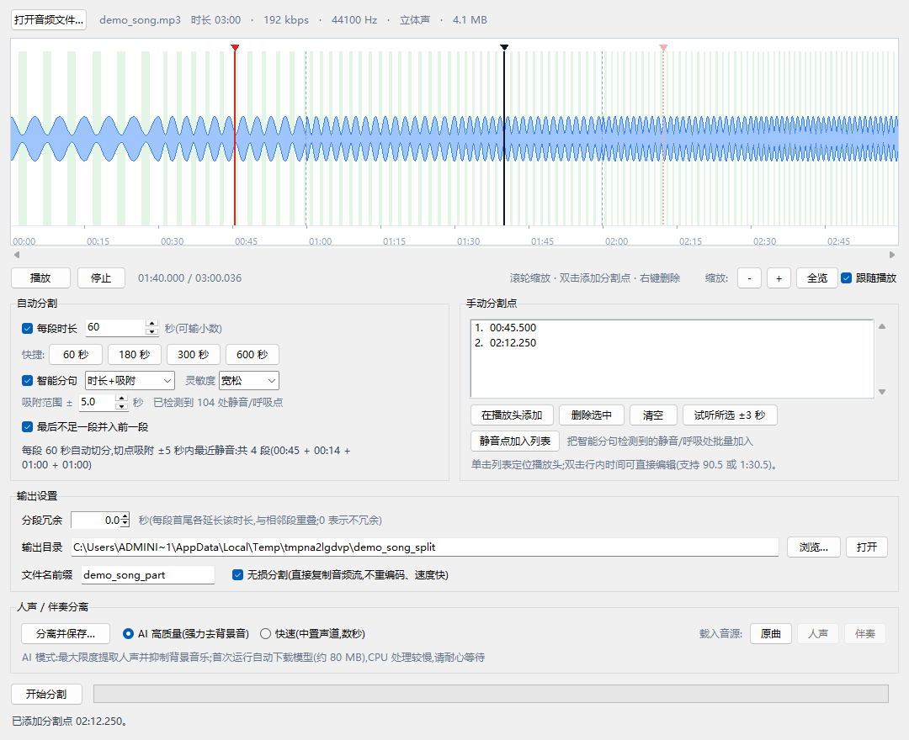

# MP3 分割工具

一个基于 Python + tkinter 的桌面工具,把一个 MP3 文件分割成若干段:

- **拖放载入**:把音频或视频文件直接拖进窗口即可打开
- **视频提音轨**:支持 mp4 / mkv / webm / mov / avi / wmv / flv / 3gp / ts / mka 等视频容器,载入时自动提取音轨参与分割
- **自动分割**:设定每段时长(单位:秒,如 300),一键切分
- **智能分句/呼吸检测**:自动识别歌词句尾的静音/呼吸段作为分割点,切点自动吸附到静音中点(或改为纯静音切分),避免切断人声
- **手动分割**:在波形上双击、拖动、右键,标出精确的分割点;列表中双击时间可精确编辑
- **两者可混用**:先按固定时长自动切,再手动微调个别位置
- **分段冗余**:每段首尾各延长指定时长(精度 0.1 秒),相邻段略有重叠,便于衔接
- **波形缩放**:滚轮缩放、滚动条平移,可查看任意局部细节
- **人声/伴奏分离**:AI 模型(最大限度提取人声、抑制背景音乐)与轻量算法双引擎,一键生成“人声”与“伴奏”,可分别保存、分别载入继续分割



## 环境要求

- Windows(Python 3.10+,开发环境为 3.12)
- 依赖会自动安装 ffmpeg 二进制,无需手动配置
- AI 人声分离依赖 Demucs(含 PyTorch CPU 版,首次安装约需下载 300 MB)
- 拖放载入依赖 tkinterdnd2(未安装时仍可用"打开音频文件…"按钮)

## 安装

```powershell
python -m pip install -r requirements.txt
```

## 运行

```powershell
python main.py
```

## 使用步骤

1. 点击 **打开音频文件…** 选择文件,**或者直接把音频或视频文件拖进窗口**(支持一次拖入多个,仅载入第一个;其他类型会被拒绝)。支持 mp3 / wav / flac / m4a / aac / ogg / wma 等音频,以及 mp4 / mkv / webm / mov / avi / wmv / flv / 3gp / ts / mka 等视频容器(自动提取音轨);非 MP3 输入会自动重编码输出 MP3。
2. 设置分割方式:
   - **自动分割**:勾选"每段时长",输入秒数(如 `300`、`90.5`,也兼容 `5:00` 这类写法),或点快捷按钮;可选"最后不足一段并入前一段"。
   - **智能分句/呼吸检测**(默认开启):载入文件后自动检测静音/呼吸段(以浅绿色带显示在波形上,状态栏会显示检测到的处数);灵敏度可选 宽松/标准/严格(默认宽松,能识别更轻微的呼吸停顿),切换后自动重新检测;可在两种模式间切换:
     - **时长+吸附**(默认):仍按"每段时长"切分,但每个自动切点会吸附到 ±吸附范围内最近的静音中点(吸附范围默认 5 秒,可调);未找到静音时保持原位置。
     - **纯静音切分**:忽略"每段时长",只在静音/呼吸中点切分,段长随歌曲自然分句变化;过短的相邻段会自动过滤合并。
   - **手动分割**:在波形上双击添加分割点,拖动红线微调,右键删除;也可用"在播放头添加"按钮,或点"静音点加入列表"把检测到的静音/呼吸处批量加入后再微调。单击列表中的项可定位播放头,双击时间可直接编辑,"试听所选 ±3 秒"用于确认位置。
3. 设置 **分段冗余**(可选):例如填 `1.5`,每段首尾各延长 1.5 秒、相邻两段重叠 3 秒,便于无缝衔接;冗余超过段长一半时会自动按段长限制。预览区会提示实际冗余量,波形上淡黄色区域即重叠区。
4. 设置输出目录与文件名前缀,选择是否"无损分割"。
5. 点击 **开始分割**,完成后可直接打开输出目录。
6. **(可选)人声/伴奏分离**:在"人声 / 伴奏分离"区选择引擎(默认 AI 高质量),点击 **分离并保存…**,选择保存目录后生成 `xxx_vocals.mp3` 与 `xxx_instrumental.mp3`;再点"载入音源"里的 **人声** 或 **伴奏**,即可将它载入为当前音源,套用上面任一种分割方式单独分割;点 **原曲** 随时切回。

### 波形区操作

| 操作 | 效果 |
| --- | --- |
| 单击波形 | 播放头跳到该位置;播放中会从该处继续播放 |
| 双击波形 | 在该位置添加手动分割点 |
| 拖动红色竖线 | 微调分割点位置 |
| 右键分割点 | 删除该分割点 |
| 滚轮 | 以鼠标位置为中心缩放(时间颗粒度最细可到 0.05 秒) |
| Shift + 滚轮 | 左右平移视窗 |
| 缩放按钮 / 全览 | 逐步放大、缩小;一键回到全览 |
| 跟随播放 | 勾选后播放头移出视窗时自动滚动跟随 |
| 拖动下方滚动条 | 平移视窗 |
| 双击分割点列表中的时间 | 就地编辑该分割点(支持 `90.5` 或 `1:30.5`) |

颜色说明:黑色竖线为播放头;红色实线为生效的手动分割点;浅红虚线为因"末段并入"等原因未生效的标记;灰色虚线为自动分割点;淡黄色区域为冗余重叠区;浅绿色区域为检测到的静音/呼吸段(智能分句开启时显示)。

### 智能分句(静音 / 呼吸检测)

- 检测基于 ffmpeg silencedetect,静音区间中点即为"呼吸点";灵敏度三档,切换后自动作废旧结果并重新检测:
  - **宽松**(默认):阈值 -30 dB、最短静音 0.25 秒 — 轻呼吸、微停顿也能识别(推荐先试这档)
  - **标准**:阈值 -35 dB、最短静音 0.35 秒 — 平衡
  - **严格**:阈值 -45 dB、最短静音 0.50 秒 — 只取明显长停顿,减少误报
- 载入文件后自动在后台检测,完成后波形上以浅绿色带标出;状态栏提示"已检测到 N 处静音/呼吸点"。
- **时长+吸附**:适合"按固定时长切段、同时不想切断句子"的场景;吸附范围越大越容易改到静音处,设为 0 即关闭吸附。
- **纯静音切分**:适合按歌曲自然分句切分;短于 1 秒的碎段会被自动过滤,与相邻段合并。
- 手动分割点不会吸附,始终落在你指定的位置。

### 时间输入格式

`300`(秒)、`90.5`(秒,支持一位小数)、`90s`、`5m`、`1.5h`、`5:00`(分:秒)、`1:02:03`(时:分:秒)、`5分30秒` 均支持。

## 人声 / 伴奏分离

提供两种引擎,可在界面上随时切换:

### AI 高质量(默认,推荐)

基于 Demucs 神经网络模型,最大限度提取人声并抑制背景音乐(伴奏也会同步分离)。不同歌曲的混音方式不同，任何模型均可能有少量残留或伪影。

- 需要安装:`python -m pip install demucs`(含 PyTorch CPU 版,约 300 MB);模型在首次分离时自动下载(约 80 MB,走 hf-mirror.com 国内镜像)
- 分离效果最好,适合提取人声做二次创作
- 依赖 CPU 推理:一首 4 分钟的歌约需 2~5 分钟(与 CPU 性能有关)
- 支持单声道与立体声文件

### 快速(轻量算法)

纯 ffmpeg 中置声道算法,数秒完成:

- **人声**:取左右声道平均值(人声通常位于中央),并限制在人声频段
- **伴奏**:左右声道相减(L-R),消除中央成分,并补偿低频
- 仅支持**立体声**文件;对大多数人声居中的歌曲效果尚可,但人声会保留居中乐器与部分背景音

### 共同说明

- 分离结果是独立的 MP3 文件,可单独保存、单独载入继续分割
- 未安装 Demucs 时 AI 选项自动禁用,界面会提示安装命令

## 无损与重编码

- **无损分割(默认)**:直接复制音频流(`-c:a copy`),不重新编码,速度快、音质不变,分割精度约一帧(约 0.03 秒)。
- **重编码**:对非 MP3 输入会自动启用,使用 libmp3lame 输出标准 MP3。

输出文件按序号命名,例如 `歌曲名_part01.mp3`、`歌曲名_part02.mp3`…(同一前缀重复分割会覆盖之前的输出)。

## 测试

```powershell
python tests/test_engine.py   # 引擎与时间码单元测试(29 项:含冗余、末段并入、静音吸附/切分/灵敏度、轻量/AI 人声分离)
python tests/smoke_gui.py     # 界面冒烟测试(54 项):真实加载、拖放(含视频容器)、试听转码、智能分句、拖动、缩放、编辑、分离(双引擎)、分割并截图到 screenshots/
```

## 项目结构

```
main.py                     入口(含高分屏适配)
mp3_splitter/
    app.py                  tkinter 图形界面(波形缩放、就地编辑、冗余预览、智能分句面板)
    audio_engine.py         ffmpeg 封装:探测 / 波形 / 静音检测与分段规划 / 切割 / AI( Demucs)与轻量人声分离
    player.py               Windows MCI 试听播放器
    timecode.py             时间解析与格式化
tests/
    test_engine.py          引擎单元测试
    smoke_gui.py            界面冒烟测试
requirements.txt
```

## 常见问题

- **提示"未找到 ffmpeg"**:执行 `pip install imageio-ffmpeg`;若系统已装 ffmpeg,程序会优先使用系统的。
- **播放按钮不可用**:内置试听基于 Windows MCI;flac / m4a / ogg 等格式会自动转码为临时 MP3 供试听(载入稍慢一两秒)。若仍不可用则不影响分割功能,可先用外部播放器确认分割点。
- **分段时长与设定略有差异**:MP3 按帧(约 26 ms/帧)对齐,属正常现象;开启"智能分句"后自动切点会吸附到附近静音/呼吸处,与整齐的时长格点不同亦属预期(需要严格等长时取消勾选即可)。
- **没检测到静音/呼吸点**:可把"灵敏度"切到**宽松**(阈值 -30 dB、最短静音 0.25 秒,能识别更轻微的呼吸停顿);若仍识别不到(如整首歌几乎没有安静间隙),可改用"手动分割"逐点标注。
- **拖放文件没反应**:确认已安装 tkinterdnd2(`pip install tkinterdnd2`);未安装时窗口不支持拖放,可改用"打开音频文件…"按钮。
- **载入视频文件**:只提取其中的音轨(不显示画面),波形与分割对象均为音频;分割结果仍是 MP3。
- **AI 分离提示模型下载失败**:Demucs 模型默认走 hf-mirror.com 国内镜像;如已有代理,可设置环境变量 `HF_ENDPOINT` 指向其他地址(例如 `https://huggingface.co`)。
- **AI 分离速度慢**:CPU 推理所致,与音乐时长成正比;选择需求不高时可用快速引擎。
